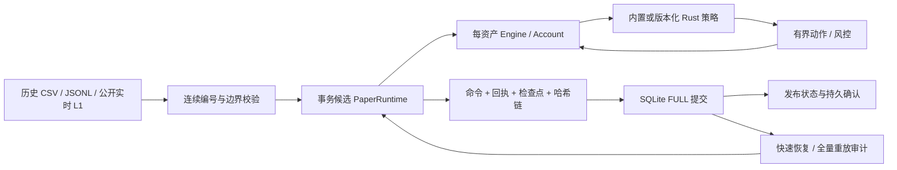
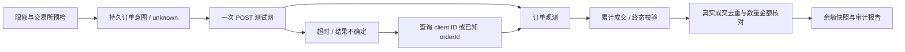
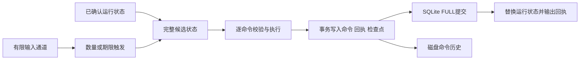

# 架构与策略扩展

外部测试网执行有独立确认边界：

测试网图没有通向纸面成交账本的边；策略外部自动路由尚未实现。查询不到未知订单仍不重新发送，必须先解决未知结果。

`types` 提供有构造边界的价格、数量和订单值；`account` 只核算实际成交；`engine` 独占账户和订单，执行层不操作文件。`strategy` 只消费借用视图和引擎生成的回报。

`config` 定义版本化配置和内置策略工厂；`paper` 提供全局模拟时钟、整数资产索引、账户隔离、风控与批量动作；`store` 在事务中保存候选命令、回执和受验证检查点，提交后才发布候选；`journal` 保留逐条同步文件WAL路径，恢复时调用同一命令处理器；`storage` 提供排他锁与不可覆盖的报告发布。检查点恢复逐项验证账户、订单、窗口与网格，不直接接受任意反序列化状态。

## 自定义策略

实现 `Strategy` 的 `on_quote`，或覆盖 `on_quote_batch`。单动作接口仍适合入门；批量接口适合拆单、撤单后重新提交、多个价位的委托。每次回调可提交最多 64 个非空动作；忽略缓冲区溢出错误仍会触发暂停，整个信号批次不会应用。撮合发生在信号前，因此当前报价已经完成的成交不会因为策略错误回滚。

平台按动作顺序执行；这组动作不是原子事务，某笔被拒不会回滚已经接受的前一笔。全部动作由同一只读视图生成，实际资源校验逐笔重新执行。回报通过 `on_event` 发送；通过核心风控的提交结果还会进入 `on_submit_result`。平台级风控拒绝从 `Receipt::notices` 观察，不能把“未生成 Engine 拒单事件”当作成功。

参见 `examples/custom_strategy.rs`。用 `PaperRuntime::with_strategies` 注册 `Box<dyn Strategy>`：动态分发位于信号边界，执行内核仍直接访问连续订单/活跃索引。自定义策略的参数与配置含义由调用方校验。

0.4通过 `StrategyRegistry` 支持编译进运行器的自定义持久策略；`name/version/parameters` 与 `custom_checkpoint` 将状态接入事务、恢复和审计。默认CLI只加载内置工厂。完整模板见[STRATEGIES](STRATEGIES.md)。加入持久策略时：

1. 实现策略及严格参数/状态验证工厂，注册固定name/version；恢复状态必须规范且与配置一致。
2. 信号仅依赖命令流、只读状态和确定性内存；随机策略需要显式种子，不可读取墙钟或外部 I/O。
3. 更新执行版本，增加中途恢复与连续运行的逐回执对照测试。
4. 保留旧二进制和旧配置处理旧日志，不在旧会话中热替换代码。

## 多资产与时间

配置数组下标就是稳定 `market` ID。恢复不能改变数组顺序。每个资产持有独立 Engine/策略/预算，事件中的订单号只在该资产内唯一；全局身份是 `(market, order_id)`。

输入资产行情必须先按非下降时间归并；同时间允许不同资产事件，报价序号在各自资产内严格递增，全局命令序号连续递增。`advance` 与报价推进同一模拟时间轴。平台不猜测乱序消息的正确位置，不用墙钟改变历史结果。

独立预算的收益可以用于自己的同币种统计，但本版本没有跨币种换算、组合净额、共同保证金、资金调拨或同时跨资产原子下单。

## 成本边界

直接调用 Engine，使用预分配历史/活跃索引和静态事件接收器，可以独立研究 CPU 行为。PaperRuntime 额外处理风控、策略动态分发和回执 Vec；SQLite事务会话再增加候选恢复、JSON、哈希与同步磁盘写入。它们的成本不混入核心扫描基准，也没有为追求漂亮数字绕过可靠性确认。

BookFeed 用预分配双缓冲实现帧级原子性，复制成本 O(depth)，帧重复价位检查 O(changes log changes)。单档 OrderBook 的原始路径仍保留，不把帧级复制的性能描述成单档 O(log n)。

Rust 所有权与禁止自定义 unsafe 缩小内存风险，但不证明所有第三方依赖或未来策略永不泄漏。策略回调属于受信任代码；隔离不可信插件、沙箱与热加载不在当前范围内。

## 0.3 事务边界与有限热状态

`store.rs` 封装候选状态、SQL事务、磁盘去重、检查点验证和全量重放审计。`kaze-run` 负责有界输入、批次期限、回执传输、健康报告与备份。每命令后稳定回收终态记录使最终投影与批次切分无关；账户、活跃委托、下一订单 ID、策略窗口、风控与时钟保留。热订单二分查找使用真实 ID，回收后不能用 ID-1 当 Vec 下标。

`PaperSnapshot` / `EngineSnapshot` 可序列化但恢复要重新验证不变量；它们不取代审计历史或身份认证。内存自定义策略默认不提供 checkpoint，持久化需要显式注册确定性内置策略与版本，不能把任意 trait object 的内存字节当快照。

依赖新增 rusqlite bundled，交易决策和资金类型不依赖数据库。SQLite 的同步和批次复制是控制路径成本，CPU内核保持同步确定性，不引入网络运行时。Linux专用绑核、io_uring、SIMD并未启用；先测量当前瓶颈再决定优化。

## 0.4 模块地图

| 模块 | 职责与边界 |
|---|---|
| `feed` / `decimal` | 借用JSON字段、精确价格与数量缩放、L1更新身份/时钟检查；数量按lot向下量化 |
| `registry` / `paper` / `store` | 可信工厂、有限策略状态、提交前可恢复性验证、命令回执与检查点同事务 |
| `research` / `kaze-research` | 严格训练/测试边界、独立现金账户、训练选参、冻结成本压力与数据身份 |
| `execution` / `binance` | 独立外部意图、未知提交结果、稳定orderId撤单查询、真实成交/余额观测 |
| `kaze-live-paper` | 有界网络输入、单SQL写入者、静默/断线/溢出停止、接收至持久确认采样 |

增量流动性预算和不利滑点用于压力研究；L1不能重建真实队列位置或市场冲击。具体证明到哪一层、三个门槛的状态见[ACCEPTANCE](ACCEPTANCE.md)。
