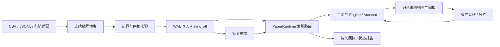

# 架构与策略扩展

`types` 提供有构造边界的价格、数量和订单值；`account` 只核算实际成交；`engine` 独占账户和订单，执行层不操作文件。`strategy` 只消费借用视图和引擎生成的回报。

`config` 定义版本化配置和内置策略工厂；`paper` 提供全局模拟时钟、整数资产索引、账户隔离、风控与批量动作；`journal` 在状态变化前记录完整命令，恢复时调用同一命令处理器；`storage` 提供排他锁与不可覆盖的报告发布。持久层不反序列化私有引擎状态，避免跳过核心构造校验。

## 自定义策略

实现 `Strategy` 的 `on_quote`，或覆盖 `on_quote_batch`。单动作接口仍适合入门；批量接口适合拆单、撤单后重新提交、多个价位的委托。每次回调可提交最多 64 个非空动作；忽略缓冲区溢出错误仍会触发暂停，整个信号批次不会应用。撮合发生在信号前，因此当前报价已经完成的成交不会因为策略错误回滚。

平台按动作顺序执行；这组动作不是原子事务，某笔被拒不会回滚已经接受的前一笔。全部动作由同一只读视图生成，实际资源校验逐笔重新执行。回报通过 `on_event` 发送；通过核心风控的提交结果还会进入 `on_submit_result`。平台级风控拒绝从 `Receipt::notices` 观察，不能把“未生成 Engine 拒单事件”当作成功。

参见 `examples/custom_strategy.rs`。用 `PaperRuntime::with_strategies` 注册 `Box<dyn Strategy>`：动态分发位于信号边界，执行内核仍直接访问连续订单/活跃索引。自定义策略的参数与配置含义由调用方校验。

持久运行当前只允许 `StrategyConfig` 中版本化的内置策略。加入持久策略时：

1. 增加配置变体与严格参数验证、工厂构造。
2. 信号仅依赖命令流、只读状态和确定性内存；随机策略需要显式种子，不可读取墙钟或外部 I/O。
3. 更新执行版本，增加中途恢复与连续运行的逐回执对照测试。
4. 保留旧二进制和旧配置处理旧日志，不在旧会话中热替换代码。

## 多资产与时间

配置数组下标就是稳定 `market` ID。恢复不能改变数组顺序。每个资产持有独立 Engine/策略/预算，事件中的订单号只在该资产内唯一；全局身份是 `(market, order_id)`。

输入资产行情必须先按非下降时间归并；同时间允许不同资产事件，报价序号在各自资产内严格递增，全局命令序号连续递增。`advance` 与报价推进同一模拟时间轴。平台不猜测乱序消息的正确位置，不用墙钟改变历史结果。

独立预算的收益可以用于自己的同币种统计，但本版本没有跨币种换算、组合净额、共同保证金、资金调拨或同时跨资产原子下单。

## 两条性能路径

直接调用 Engine，使用预分配历史/活跃索引和静态事件接收器，可以独立研究 CPU 行为。PaperRuntime 额外处理风控、策略动态分发和回执 Vec；DurableSession 再增加 JSON、哈希、同步磁盘写入。它们的成本不混入核心扫描基准，也没有为追求漂亮数字绕过可靠性确认。

BookFeed 用预分配双缓冲实现帧级原子性，复制成本 O(depth)，帧重复价位检查 O(changes log changes)。单档 OrderBook 的原始路径仍保留，不把帧级复制的性能描述成单档 O(log n)。

Rust 所有权与禁止自定义 unsafe 缩小内存风险，但不证明所有第三方依赖或未来策略永不泄漏。策略回调属于受信任代码；隔离不可信插件、沙箱与热加载不在当前范围内。
